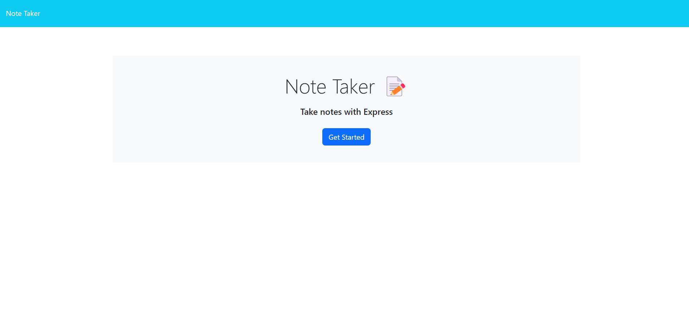

# Project Title
    Note Taker

## Description
    this web app lets user take notes, post them to be viewed later and delte notes.
## Installation
    To install make sure to run npm i to install all the dependacies.
## Instructions
    click get started, to add note give a title, write a note, click save note, to delete note click trash icon by note.
## Usage
    used to keep notes.
## Test
    N/A
## Credits
    N/A
## License

## How to Contribute
    N/A
## Features
    Add and delete notes.
## Questions
https://github.com/RyanPersaud03?tab=repositories
n/a
## Image
